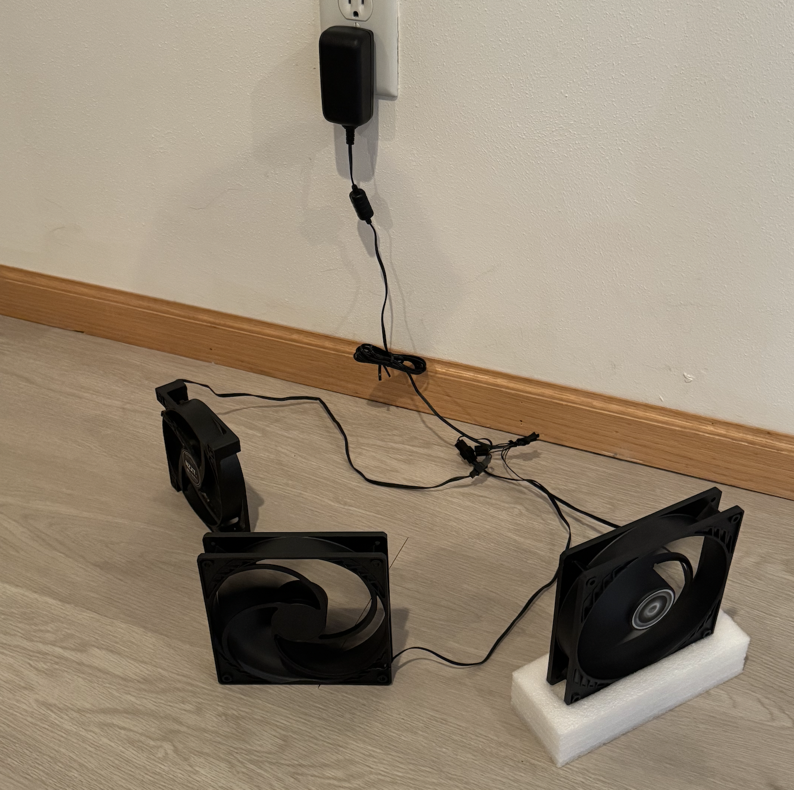
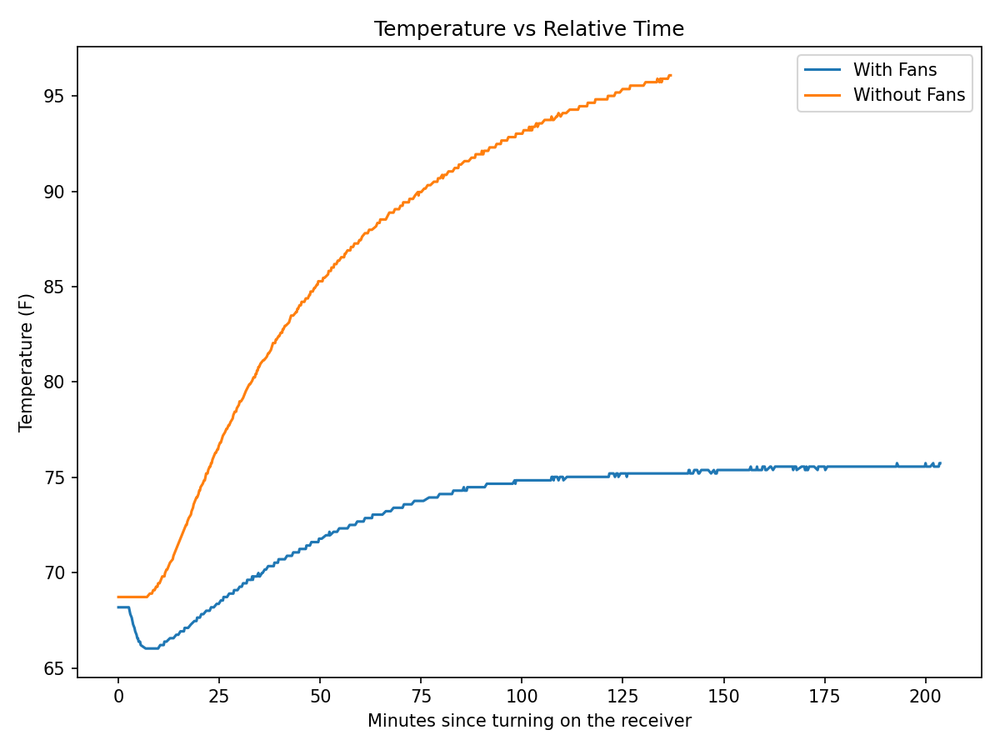

## Intro

I recently picked up a beautiful Denon X4500H receiver that someone was selling locally to control my home theater setup. I am in awe of this machine after only using receivers made in the 90's. It should last me a very long time, assuming it is kept in good condition. My receiver sits inside my TV console drawer. This is a common setup, but a recipe for disaster since one of the biggest causes of failure in a receiver is overheating.

Luckily my TV console has some holes in the bottom and back side so air can flow, but I could still feel a lot of heat over the receiver after a few hours of usage. It's winter currently and could get much warmer in the summer or heat could build up after longer usage.

## Solution

There are several possible ways to go about fixing this. The most obvious is to move the receiver out of the TV console. It could go on top of the TV console, but aesthetically this wasn't ideal. Then I remembered I have an old Raspberry Pi 3 with a [DHT22 temperature sensor](https://www.amazon.com/dp/B073F472JL) from a past project. I also have extra PC fans laying around - surely the Pi could control those, right? As it turns out, not really. [The fans](https://www.amazon.com/dp/B0DPX94PSL) are 12 volts, and the Pi GPIO pins are 3.3V, so they can't directly drive a 12V fan's power/current. I'd need an intermediary circuit to power them.

In the process, I found that the fans could be powered by wiring them with an old power supply [like this](https://www.sparkfun.com/wall-adapter-power-supply-5vdc-2a-barrel-jack.html). Just cut-off the barrel jack to expose the wires, use a multimeter to confirm the positive and negative wires, then twist the bare wires together and screw on a wire nut to secure them. I had 3 fans rated at ~0.35A each, so I just had to make sure the power supply was rated greater than 1.05A. 

I put them in the TV console with the receiver and let them run 24/7. This was an easy solution, but wasn't very satisfying since the fans didn't _need_ to be on when the receiver wasn't. They also make a subtle noise that can be heard when the speakers are not playing anything. The fan only use 12w in total so some quick math shows that this will cost about $23.13 to run this 24/7 for a full year at 22¢/kWh.

$$ 0.012 \text{ kW} * 8,760 \text{ hours/year} = 105.12 \text{ kWh/year} $$

$$ 105.12 * \$0.22 = \$23.13 \text{ /year} $$

After some more researching I found that the receiver has a 3.5mm 12v TRIGGER OUT port! With this, we can plug the fans into a [power relay](https://www.amazon.com/dp/B00WV7GMA2?ref=ppx_yo2ov_dt_b_fed_asin_title) that only provides power when the 12v signal is passed on. I picked up a two pack of [3.5mm Male Jack to Bare Wire](https://www.amazon.com/dp/B0BVQ21L6D?ref=ppx_yo2ov_dt_b_fed_asin_title&th=1) cables for $8 to connect the receiver to the power relay.

Now the fans turn on/off automatically with the receiver!

## Result

How can you confirm anything changed without data? In order to make this more official, the raspberry pi was pulled out of retirement. I wrote a script to read the temperature every 10 seconds and save the results in a SQLite table for analysis.

The results were clear after collecting just two samples. With the fans, the temperature leveled out around 75°F. Without the fans, the temperature climbed past 95°F so I cut the experiment short.

I had originally planned a full hypothesis test with statistical significance and all of that, but I scrapped the plan after collecting the data. I'll leave the original plan details below since I already put the time in to write it out. 

Original hypothesis test plan

:::{.text-block}
The research question is "do the fans improve temperatures relative to control (no fans), conditional on starting temp and run time." Temperature improvements can mean several things such as a decrease in; (1) peak temp, (2) steady state temp, (3) time to reach threshold temp, or (4) temperature-time integral. I chose peak temperature (95th percentile to avoid spikey anomalies) because it is likely the best marker of risk to the receiver. I'll look at the others for interest, but not choosing them as a primary endpoint to avoid multiple test considerations or p-hacking.

Additional checks will give us some confidence that we are testing fairly:

1. Temperature trend/level should be consistent between the treatment/control before turning on the receiver, and after the receiver is off.
2. Same trial run lengths between the treatment/control. This ensures that we have a fair distribution of short and long run time trials to compare.
3. The DHT22 is rather unreliable and observations are lost due to no read / checksum fails. Failure rate might be correlated with humidity/temp/noise so I'll examine sensor corruption rates.

:::

<!-- Convert to html -->
<!-- pandoc receiver_fan_automation.md -o receiver_fan_automation.html -s --section-divs --template=pandoc_template.html --mathjax -->