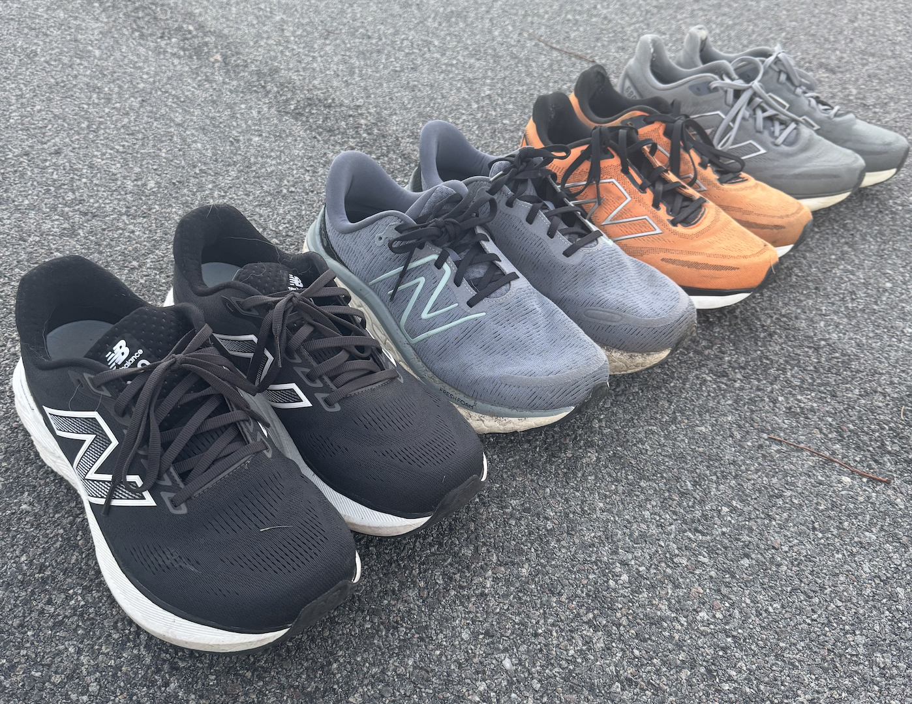

## Goal
In January 2025, I set out to run a marathon. Shortly after registering for the [Madison Marathon](https://madisonmarathon.org/) the competative side of me kicked in, and I upped the goal to be an *above average* marathon runner. I defined that as being in the top 50% of male runners. Luckily, past results are published online so I was able to generate some summary statistics to narrow in on the target.

Male Runner Results — 2024 Madison Marathon

| Time Bracket | Number of Runners | Percentage |
|--------------|-------------------|------------|
| Sub-3:00     | 71                | 5.8%       |
| Sub-3:30     | 233               | 19.1%      |
| Sub-4:00     | 519               | 42.5%      |
| Sub-4:30     | 827               | 67.7%      |
| Sub-5:00     | 1,018             | 83.3%      |

## AI Coach

I've used Garmin's coach in the past, but the max distance for a race is a half-marathon, so I needed to improvise. There are [plenty](https://www.halhigdon.com/training/marathon-training/) [of](https://marathonhandbook.com/trainingplans/marathon-training-plans/) [great](https://www.mymottiv.com/marathon-training-plan) marathon training plans online, but I wanted more autonomy, so I built my own coaching tool. 

### Data

I used deep research from Perplexity and ChatGPT to gather articles and papers on various running topics that I found interesting while training, such as "What is the ideal running cadence?" or "Are warmups and cooldowns important?" I reviewed the results myself to verify accuracy by looking at what cohorts were studied, how many participants, and if the findings had been replicated in other studies. After review, the notes were added as context for the coach. This knowledge base served as the primer for the LLM to give it the latest relevant information. Ideally, this process would be continously updating as need data came out, but that is a future problem to solve.

Next, I used [garth](https://github.com/matin/garth) to pull my latest running data from Garmin. Below is an example of what information is gathered about my training status.

Example training status text

:::{.text-block} 

    Weeks until marathon: 2
    VO₂ Max (Running): 58
    Lactate Threshold Pace (min:sec/mi): 7:36
    Lactate Threshold HR: 174

    Current estimated race paces:

    | Race         | Est. Race Pace   | Est. Race Time   |
    |--------------|------------------|------------------|
    | 5K           | 6:29             | 0:20:08          |
    | 10K          | 6:54             | 0:42:53          |
    | HalfMarathon | 7:15             | 1:35:06          |
    | Marathon     | 7:58             | 3:28:46          |

    Weekly mileage for the last 12 weeks:

    | week_start   | week_end   |   mileage |   z1_min |   z2_min |   z3_min |   z4_min |   z5_min |   rolling_avg |   pct_change |
    |--------------|------------|-----------|----------|----------|----------|----------|----------|---------------|--------------|
    | 2025-07-28   | 2025-08-03 |     48.97 |    24.74 |   132.89 |   181.87 |    99.38 |     5.86 |        nan    |       nan    |
    | 2025-08-04   | 2025-08-10 |     63.55 |    39.07 |   193.68 |   272.68 |    96.98 |     1.7  |         56.26 |        29.77 |
    | 2025-08-11   | 2025-08-17 |     60.23 |    53.5  |   239.87 |   179.64 |   101.04 |     2.48 |         61.89 |        -5.22 |
    | 2025-08-18   | 2025-08-24 |     54.59 |    57.56 |   192.19 |   180.64 |    74.45 |     4.53 |         57.41 |        -9.36 |
    | 2025-08-25   | 2025-08-31 |     41.22 |    27.56 |   108.71 |   189.06 |    44.9  |     0    |         47.9  |       -24.49 |
    | 2025-09-01   | 2025-09-07 |     13.08 |    50.95 |    28.96 |    38.9  |    12.13 |     0    |         27.15 |       -68.27 |
    | 2025-09-08   | 2025-09-14 |     15.81 |    21.13 |    50.54 |    55.59 |    33.19 |     0    |         14.44 |        20.87 |
    | 2025-09-15   | 2025-09-21 |     22.13 |    63.81 |    82.61 |    79.21 |     8.33 |     0    |         18.97 |        39.97 |
    | 2025-09-22   | 2025-09-28 |     30.43 |    42.25 |    88.62 |   159.35 |     1.33 |     0    |         26.28 |        37.51 |
    | 2025-09-29   | 2025-10-05 |     41.52 |    47.68 |   143    |   182.8  |    23.1  |     5.85 |         35.98 |        36.44 |
    | 2025-10-06   | 2025-10-12 |     43.66 |    23.96 |   187.84 |   152.41 |    37.3  |     0    |         42.59 |         5.15 |
    | 2025-10-13   | 2025-10-19 |     44.4  |    43.68 |   181.39 |   138.66 |    42.37 |     0    |         44.03 |         1.69 |

    Daily mileage for the last 2 weeks:

    | date       |   mileage |   z1_min |   z2_min |   z3_min |   z4_min |   z5_min |
    |------------|-----------|----------|----------|----------|----------|----------|
    | 2025-10-09 |      7.19 |     6    |    41.33 |    21    |     0    |        0 |
    | 2025-10-10 |     10.03 |     6.88 |    38.15 |    15.82 |    29.02 |        0 |
    | 2025-10-11 |      5.5  |     2.03 |    42.62 |     9.43 |     0    |        0 |
    | 2025-10-12 |     15.69 |     0.57 |    22.45 |   101.96 |     8.28 |        0 |
    | 2025-10-13 |      1.05 |     5.07 |     7.9  |     0.25 |     0    |        0 |
    | 2025-10-14 |     13.48 |     0.96 |    14.27 |    58.77 |    35.46 |        0 |
    | 2025-10-15 |      1.01 |     8.11 |     4.05 |     0    |     0    |        0 |
    | 2025-10-16 |      9.37 |    16.27 |    37.44 |    32.02 |     1.35 |        0 |
    | 2025-10-17 |      4.16 |     4.77 |     5.33 |    21.45 |     5.56 |        0 |
    | 2025-10-18 |     14.21 |     6.4  |   101.74 |    24.55 |     0    |        0 |
    | 2025-10-19 |      1.12 |     2.1  |    10.66 |     1.62 |     0    |        0 |
    | 2025-10-20 |      6.85 |     5.11 |    15.84 |    43.6  |     0    |        0 |
    | 2025-10-21 |      7.71 |     2.4  |    42.65 |    27.24 |     0    |        0 |
:::

I had it create a long term training plan that would be used to guide weekly workout structure going forward. 

Initial Training Plan

:::{.text-block}

Here is the training plan, starting 17 weeks away from the marathon and broken into 3 weeks blocks. 

### Phase 1: Base & Strength (Weeks 17–14)
Mileage: Stabilize between 45–55 miles per week; cautiously progress up to a 15-20% increase if well-tolerated, based on your historical mileage progression (your current weekly mileage can safely rise slightly above the conventional 10% rule).

Intensity distribution: 80% easy mileage (Zones 1–2), ~10–15% threshold (Zone 3–4), <5% VO₂max (Zone 4–5).

Key workouts:

* Weekly long run: 13–15 miles, progressing from Zone 2, finishing the last 2-3 miles at threshold (Zone 4, HR ~168–174 bpm).
* Threshold workouts (1 per week):
	* Example: 5 × 5 minutes at lactate threshold (~7:36 pace), 1 min jog recovery.
	* Strength and cross-training: Include weekly strength/core sessions and occasional cycling/swimming for recovery.

### Phase 2: Lactate Threshold & Aerobic Capacity (Weeks 13–9)
Mileage: Sustain or increase slightly, peaking around 50–60 miles/week.

Intensity distribution: 75–80% easy, 15–20% threshold, ~5% VO₂max intervals.

Key workouts:

* Extended tempo runs: 30–40 min continuous at LT (7:36 pace).
* Cruise intervals: 4 × 8 minutes at LT with 2 min recovery.
* Weekly long run: 15–18 miles, steady pace with a moderate finish at marathon pace (~7:50 min/mi).
* Cadence focus: Experiment modestly with cadence adjustments (+3-5%) during moderate runs to enhance running economy and reduce injury risk.

### Phase 3: Marathon-Specific Endurance (Weeks 8–4)
Mileage: Peak training weeks, aiming for 55–65 miles/week.

Intensity distribution: ~70–75% easy, 20–25% marathon/threshold pace, ~5% VO₂max.

Key workouts:

* Marathon pace runs: 8–12 miles at goal marathon pace (7:40–7:50 min/mi).
* Long runs with marathon pace finish: 18–20 miles, last 5–8 miles at marathon pace.
* Advanced LT workouts: Alternating threshold intervals (e.g., 3 min at LT minus 20–30 sec/mi, then 1 min 10K pace, repeated for 30–40 min).
* Warm-up and cooldown protocols: Include structured dynamic warm-ups before harder runs to reduce injury risk significantly.

### Phase 4: Peak & Taper (Weeks 3–1)
Mileage: Gradual reduction, 3-week taper (~75%, 50%, and 30% of peak mileage).

Intensity distribution: Short, quality sessions maintaining intensity; mostly recovery runs.

Key workouts:

* Reduced-length marathon pace runs: 4–6 miles at goal marathon pace.
* Final tune-up threshold workout (about 10 days before race): 3 × 1 mile at threshold pace, 2 min jog recovery.
* Taper duration: Short (7–10 days of reduced load) aligns with elite practice and scientific recommendations for optimal freshness.

Physiological Targets

* Improve lactate threshold closer to 90%+ of HR_max, which is a primary factor for marathon performance.
* Include VO₂ max sessions sparingly (once every 10–14 days) to maintain top-end aerobic power.

Weekly Structure (Typical Example):

* Monday: Easy recovery run (Zone 1–2, 4–6 mi)
* Tuesday: Threshold/Cruise intervals (total ~8–10 mi)
* Wednesday: Easy/moderate run (Zone 2, 6–8 mi)
* Thursday: Rest or cross-train/active recovery
* Friday: Marathon pace or tempo run (6–12 mi total)
* Saturday: Easy/moderate run (5–7 mi)
* Sunday: Long run (13–20 mi, progressive structure)

Warmups and Cooldowns

* Consistent dynamic warm-ups are scientifically supported for reducing injury and improving performance; active cooldowns are optional but beneficial for recovery and lactate clearance.

Monitoring & Adjustments

* Monitor heart rate closely during threshold and marathon pace efforts. Aim for lactate threshold HR (currently ~174 bpm) during threshold workouts.
* Adapt training based on RPE and fatigue; be flexible rather than strictly adherent to mileage.

Considerations for Cadence

* Aim for slight optimization (individual-dependent), potentially increasing running economy by experimenting incrementally during easy/moderate runs.
:::

### Workout Creation

With the LLM primed with the latest running research and my current training status, I had it generate my workouts on a weekly basis. The workouts were sent to my Garmin account via their API so that I could follow along easily. Here is an example of a workout that was generated through this process:

  

### Limitations

It's useful to note the biggest downsides of using an AI coach compared to what an expert human coach could provide. Here are a few that stood out to me:

1. LLMs are [Sycophantic](https://arxiv.org/pdf/2310.13548). They will tell you what you want to hear, which is obviously not a trait of a great coach.
2. Reactive assistence. If you do not know what to ask, the LLM cannot help you. A real coach can probe and provide guidance proactively. 
3. Input is entirely text based. Running form is essential; and ideally it would be monitored throughout training. Visual feedback would help spot weaknesses or early injuries.
4. [Garbage in, garbage out](https://en.wikipedia.org/wiki/Garbage_in,_garbage_out). This whole thing relies on Garmin having accurate data. My lactate threshold prediction on Garmin remained the same for the last 8 months of training, which I am now confident is incorrect, but it took months to realize. Unfortunately, lactate threshold is one of the most important predictors of marathon performance, and key to accurate workout programming.

## My Experience and Recommendations

I placed in the top ~10% of male participants! I saw tremendous improvement this year as I increased mileage from running 25 miles per month in December 2024 to 250 miles in August 2025. Much of my progress is likely attributed to just putting on the miles, but it was really handy to have the running plan set automatically and to be able to customize it as needed. 

On race day, I was lucky to have the great support of family and friends cheering in the freezing cold. My friend Anthony is an experienced marathon runner and he was able to follow me on an ebike for most of the race. This was an incredible advantange on race day. 

### Shoes {#shoes}

I stuck with New Balance for some consistency and because since they had a sale on wide-toebox shoes. Here is my running shoe history for the year:

1. Fresh Foam 680v8 4E for $68.56, retired at 688.7 miles  
2. Fresh Foam 680v8 4E for $63.99, retired at 442.4 miles  
3. Fresh Foam X Kaiha Road 4E for $83.69, still using at 300+ miles, but they lost the 'pop'
4. Fresh Foam X 880 v15 4E for $150 - full retail price sadly since I bought last minute in person  

The typical recommendation is to retire shoes after 300–500 miles. You can still get use out of older shoes, but the risk of injury increases. My second pair of shoes were retired 250 miles sooner than the previous pair due to a shin splint injury. I used [RunRepeat.com's blog on shoes for shin splints](https://runrepeat.com/guides/best-shin-splints-running-shoes#shin-splints-and-running) to pick the third pair after that.

Carbon Plates - Expensive and completely optional, carbon-fiber plated shoes can give a 2–3% improvement on race time. Unfortunately, they don't last as long as standard shoes. The "pop" diminishes after about 100 to 140 miles so you need to be strategic about breaking them in. Due to the durability limitations, it's generally advised to just wear them for marathon-pace efforts about 4 weeks prior to the race, as well as a long distance run (>10 miles) two weeks prior to the race. I ended up opting out on carbon plates since I was already ahead of my goal, and the improvement wouldn't have made enough of a difference for me.

### Diet {#diet}

The best marathoners train their gut as much as their legs. Consider practicing run nutrition for any runs longer than 75 mins. It increases recovery, delays fatigue, improves GI distress, and helps with training adaptations.  

Natural sources and commercial products both work well. Both can cause GI discomfort, and both should be incorporated at easy efforts and hard efforts multiple times. Natural sources (dates, bananas, applesauce) can be more challenging to carry, so is it realistic outside of training? 

Practice your long run pre-fueling strategy. Find something for almost all long runs and use it pre-marathon. Do not change this fueling strategy on the day of the race.  

#### Carbs

The goal is to be able to consume 90+ grams of carbohydrates per hour. Combining the ingestion of fructose and glucose takes advantage of both transport mechanisms. Different ratios can be used to achieve this. 

> "There is no optimal ratio. The ratio that is optimal will change depending on amounts ingested. If 90 g/h is ingested it should be around 2:1, but if more is ingested, for example 120 g/h, 1:1 is likely better."
> Source: [The optimal ratio of carbohydrates](https://www.mysportscience.com/post/the-optimal-ratio-of-carbohydrates)

The table below will give you an idea of the fructose and glucose content of different sweeteners. 

  Glucose:Fructose Profile of Common Sweeteners

| Sweetener                        | Approx G:F Ratio | Notes                                                                                  |
|----------------------------------|------------------|----------------------------------------------------------------------------------------|
| Sucrose (table/white/brown sugar)| 1:1              | Splits to equal glucose and fructose.                                                  |
| Maple syrup                      | 1:1              | Minor free glucose/fructose; effectively 1:1 after digestion.                          |
| Honey                            | 0.6–1:1          | Varies by floral source; often fructose-heavy.                                         |
| Agave syrup                      | 0.2–0.7:1        | Brand/process dependent.                                                               |
| High-fructose corn syrup         | 0.8–1.4:1        | "HFCS 42" and "HFCS 55" refer to fructose compositions of 42% and 55% respectively.    |
| Corn syrup / Brown rice syrup    | 1:0              | Essentially no fructose; use as the “glucose side.”                                    |
| Maltodextrin                     | 1:0              | Low osmolality vs simple sugars; great for bottles.                                    |
| Fructose (powder)                | 0:1              | Use to balance mixes toward targeted ratios.                                           |

I started training with plain old (literally) granulated sugar, which has a 1:1 ratio. I'm not convinced you have to get too fancy here.

> "Similar metabolic effects can be achieved via the ingestion of sucrose [...] because intestinal absorption is unlikely to be limited by sucrose hydrolysis." 
> [Source: MDPI study on sucrose](https://www.mdpi.com/2072-6643/9/4/344)

Later, I added maltodextrin to trial ratios like 1.5:1 and 2:1. For example, to make my own running gel/juice at 90g/hr, I mixed 60g granulated sugar + 30g maltodextrin and added water. I preferred a more watery mix than normal gels. I also added 100mg of caffeine, 200mg of l-theanine, and electrolytes (see below).  

#### Electrolytes {#electrolytes}

This is largely individual dependent as well as race conditions. I targeted 600 mg of sodium per hour and made my electrolyte mix at home following [LMNT's recipe](https://drinklmnt.com/pages/ingredients#facts):

- 2,500 mg sodium chloride (for 1,000 mg sodium)  
- 385 mg potassium chloride (for 200 mg potassium)  
- 390 mg magnesium malate **or** 265 mg di-magnesium malate (for 60 mg magnesium)  

#### Hydration {#hydration}

For water intake, “drink to thirst” will usually suffice. If you want to get more precise, cooler conditions call for ~0.4 L/h, while hot weather is about ~0.8 L/h or more.

#### Pre-Race & Race Nutrition

- Day Before: Normal meals that are carb-rich (noodles, rice, potatoes).  
- Night Before: Bagels + peanut butter & honey, 1–2 bananas, large sports drink like Powerade.  
- 3 Hours Before: 1–2 bagels with light PB *or* large muffin.  
- 45 Minutes Before: Honey Stinger waffle or granola bar (familiar fuel that has been used on runs).  
- 10–15 Minutes Before: 40g caffeinated gel.  
- During Race: >= 90g of gel per hour

### Injuries

Running injuries are extremely common in marathon runners. Higher training volumes generally increases the injury risk among runners with amateuers being more susceptible to injuries as they increase mileage and are less likely to follow proper a strength training program.

> "Out of 300 runners, 126 (42%) reported at least one injury during the training period. 
> The most common injuries included medial tibial stress syndrome (24%), iliotibial band syndrome (19%), and plantar fasciitis (15%). 
> Injury incidence was significantly higher in runners exceeding 50 km/week without strength training (p=0.03). 
> Participants who followed structured warm-up and strength training routines had a 35% lower injury rate (p=0.01). 
> Footwear replacement within 500-700 km was associated with reduced injury occurrence (p=0.04)."
> 
 [Injury Incidence and Prevention Strategies Among Amateur Marathon Runners: A Prospective Cohort Study](https://www.icr-heart.com/article/injury-incidence-and-prevention-strategies-among-amateur-marathon-runners-a-prospective-cohort-study-2510/#:~:text=analysis%20included%20chi,marathon%20runners%20are%20at%20a) 

Other studies point to similar findings, anywhere between 30%-75% of marathon runners will experience a running related injury:

- 33% of half or full marathon runners reported a running related injury or illness symptom at some time during the 16-week study period (n = 161). [Running Themselves Into the Ground? Incidence, Prevalence, and Impact of Injury and Illness in Runners Preparing for a Half or Full Marathon](https://www.jospt.org/doi/10.2519/jospt.2019.8473)
- Running-related injuries were reported in 53.6% (n = 28) of elite runners and 34.6% of recreational runners (n = 254). [Exploring the Relationship between Running-Related Technology Use and Running-Related Injuries: A Cross-Sectional Study of Recreational and Elite Long-Distance Runners](https://pmc.ncbi.nlm.nih.gov/articles/PMC10970008/#sec3-healthcare-12-00642)
- 75% of elite marathon runners reported running-related musculoskeletal pain in the last 12 months (n = 199). [PREVALENCE OF MUSCULOSKELETAL PAIN IN MARATHON RUNNERS WHO COMPETE AT THE ELITE LEVEL](https://pubmed.ncbi.nlm.nih.gov/26900507/#:~:text=presence%2C%20location%20and%20intensity%20of,musculoskeletal%20pain)

### Physical Therapy

Running a marathon will expose any weaknesses you have. For me, it was my hips (fixed by doing [standing side leg raises](https://www.hingehealth.com/resources/articles/standing-side-leg-raise/)), then shins splints (likely due to a weak soleus - fixed by [bent knee calf raises](https://www.treatmyachilles.com/post/bent-knee-calf-raises-how-to-target-the-soleus-part-of-the-achilles-tendon)), and then plantar fasciitis (likely a tight calf muscle from all of the calf raises - fixed by following [these exercises](https://www.ortho.wustl.edu/content/Education/3691/Patient-Education/Educational-Materials/Plantar-Fasciitis-Exercises.aspx)).

I am biased since I'm married to a physical therapist, but her knowledge and support was invaluable. My biggest advice here is that if you can afford it, see a physical therapist. Having a professional is worth the premium when you're in pain, and it is easy to misdiagnose yourself. There are also a lot of preventative exercises you can do to strengthen the body while running, and a physical therapist can help spot areas of improvement more efficiently. 

<!-- 
Running-related injuries and pain are highly prevalent in both recreational and elite marathon runners. In a prospective cohort of 300 amateur marathon runners, 42% reported at least one injury during the training period, with medial tibial stress syndrome (24%), iliotibial band syndrome (19%), and plantar fasciitis (15%) being the most common issues; higher weekly mileage (>50 km/week) without strength training was associated with significantly higher injury incidence, while structured warm-up, strength training, and timely footwear replacement (every 500–700 km) were linked to lower injury rates <a href="#ref-1" class="ref" data-tooltip="Injury Incidence and Prevention Strategies Among Amateur Marathon Runners: A Prospective Cohort Study">[1]</a> In a 16-week study of runners preparing for a half or full marathon (n = 161), 33% reported a running-related injury or illness symptom at some point during the training block <a href="#ref-2" class="ref" data-tooltip="Running Themselves Into the Ground? Incidence, Prevalence, and Impact of Injury and Illness in Runners Preparing for a Half or Full Marathon.">[2]</a> Cross-sectional data from long-distance runners found running-related injuries in 53.6% of elite runners (n = 28) and 34.6% of recreational runners (n = 254) <a href="#ref-3" class="ref" data-tooltip="Exploring the Relationship between Running-Related Technology Use and Running-Related Injuries: A Cross-Sectional Study of Recreational and Elite Long-Distance Runners.">[3]</a> Among elite marathon runners specifically, 75% reported running-related musculoskeletal pain in the previous 12 months (n = 199) <a href="#ref-4" class="ref" data-tooltip="Prevalence of Musculoskeletal Pain in Marathon Runners Who Compete at the Elite Level">[4]</a>

### References

[1] Injury Incidence and Prevention Strategies Among Amateur Marathon Runners: A Prospective Cohort Study. <a href="https://www.icr-heart.com/article/injury-incidence-and-prevention-strategies-among-amateur-marathon-runners-a-prospective-cohort-study-2510/#:~:text=analysis%20included%20chi,marathon%20runners%20are%20at%20a">Link</a>

[2] Running Themselves Into the Ground? Incidence, Prevalence, and Impact of Injury and Illness in Runners Preparing for a Half or Full Marathon. <a href="https://www.jospt.org/doi/10.2519/jospt.2019.8473">Link</a>

[3] Exploring the Relationship between Running-Related Technology Use and Running-Related Injuries: A Cross-Sectional Study of Recreational and Elite Long-Distance Runners. <a href="https://pmc.ncbi.nlm.nih.gov/articles/PMC10970008/#sec3-healthcare-12-00642">Link</a>

[4] Prevalence of Musculoskeletal Pain in Marathon Runners Who Compete at the Elite Level. <a href="https://pubmed.ncbi.nlm.nih.gov/26900507/#:~:text=presence%2C%20location%20and%20intensity%20of,musculoskeletal%20pain">Link</a>
 
-->
